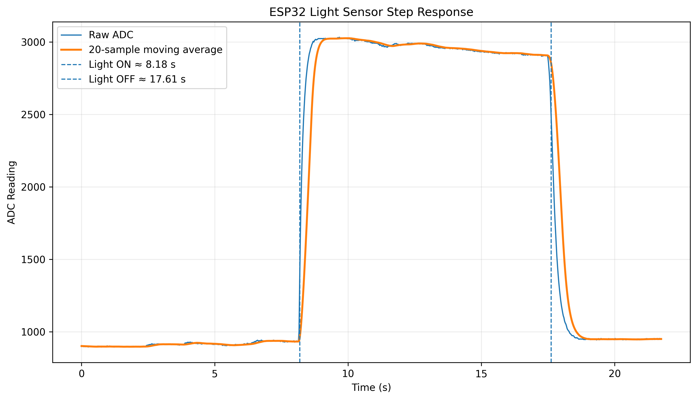

# ESP32 Environmental Data Acquisition & Signal Processing System

An ESP32-based environmental monitoring and data acquisition system integrating analog sensing, I2C environmental sensors, analog and digital filtering, and Python-based data analysis.

## Overview

This project was designed to combine analog circuit design, embedded programming, sensor interfacing, signal processing, and data analysis into a complete data acquisition system.

The system measures ambient light using a photoresistor and environmental conditions using a BME280 temperature, humidity, and pressure sensor. The photoresistor signal is conditioned using an analog RC low-pass filter before being sampled by the ESP32 ADC. A 20-sample moving-average digital filter is then applied in software.

Sensor measurements are transmitted from the ESP32 to a computer over serial communication, where Python is used to log the data to CSV files, calculate signal statistics, and visualize system performance.

## System Architecture

Light:

Photoresistor → Voltage Divider → RC Low-Pass Filter → ESP32 ADC → 20-Sample Moving Average

Environmental Measurements:

BME280 → I2C → ESP32

Data Analysis:

ESP32 → USB Serial → Python → CSV Logging → Analysis → Visualization

## Hardware

- ESP32-WROOM-32 development board
- BME280 temperature, humidity, and pressure sensor
- Photoresistor
- 10 kΩ resistors
- 10 µF capacitor
- Breadboard
- Jumper wires

## Analog Light Sensor

The photoresistor is used as part of a voltage divider to convert changes in light intensity into a measurable voltage.

The analog signal is passed through an RC low-pass filter before reaching the ESP32 ADC.

For the filter:

- R = 10 kΩ
- C = 10 µF
- RC time constant = 0.1 s
- Theoretical cutoff frequency ≈ 1.59 Hz

The cutoff frequency is calculated using:

fc = 1 / (2πRC)

## Environmental Sensor

A BME280 sensor communicates with the ESP32 using the I2C protocol.

Measurements include:

- Temperature
- Relative humidity
- Atmospheric pressure

The BME280 was detected at I2C address 0x76.

## Embedded Firmware

The ESP32 firmware performs:

- Analog-to-digital conversion of the photoresistor signal
- I2C communication with the BME280
- 20-sample moving-average digital filtering
- Circular-buffer implementation for efficient filtering
- Serial transmission of sensor data
- CSV-formatted data output for computer analysis

## Python Data Analysis

Python is used to:

- Read ESP32 measurements over serial communication
- Record sensor measurements to CSV files
- Compare raw and filtered ADC signals
- Calculate measurement variation
- Analyze system step response
- Generate plots using Matplotlib

Libraries used:

- PySerial
- Pandas
- Matplotlib
- NumPy

## Experimental Results

### Noise Test

During steady-state testing, the 20-sample moving-average filter reduced measured sample-to-sample ADC variation by approximately 19%.

This demonstrates the ability of digital filtering to reduce rapid fluctuations in sensor measurements.

### Step Response

A controlled light step was applied to the photoresistor to characterize the response of the system.

Measured response times:

| Response | Raw ADC | 20-Sample Filtered ADC |
|---|---:|---:|
| Rising 63% | 0.120 s | 0.408 s |
| Rising 90% | 0.288 s | 0.576 s |
| Falling 63% | 0.192 s | 0.456 s |
| Falling 90% | 0.432 s | 0.696 s |

The moving-average filter produced a smoother signal but increased response latency, demonstrating the engineering tradeoff between noise reduction and response speed.

## Step-Response Plot

## Skills Demonstrated

- Embedded C/C++
- ESP32 development
- Analog circuit design
- RC filter design
- Analog-to-digital conversion
- I2C communication
- BME280 sensor interfacing
- Digital signal filtering
- Circular buffers
- Serial communication
- Python
- Data acquisition
- Experimental characterization
- Signal analysis
- Technical documentation

## Future Improvements

Potential future improvements include:

- PCB implementation
- Wireless Wi-Fi data transmission
- Real-time web dashboard
- Improved ADC calibration
- Additional environmental sensors
- Comparison of additional digital filter designs
